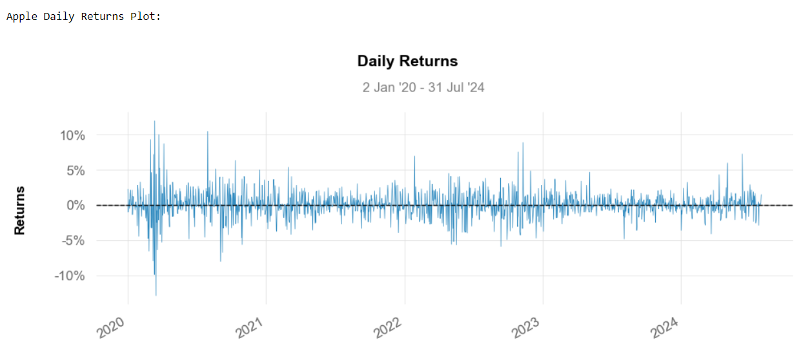
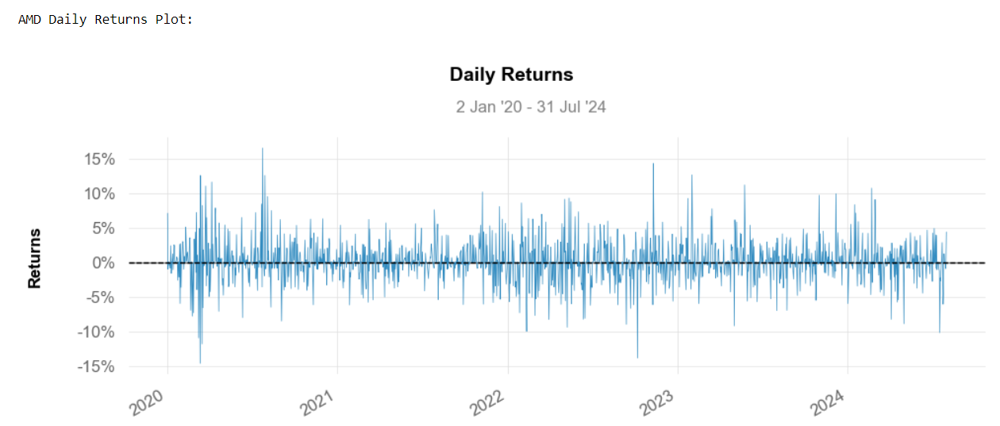
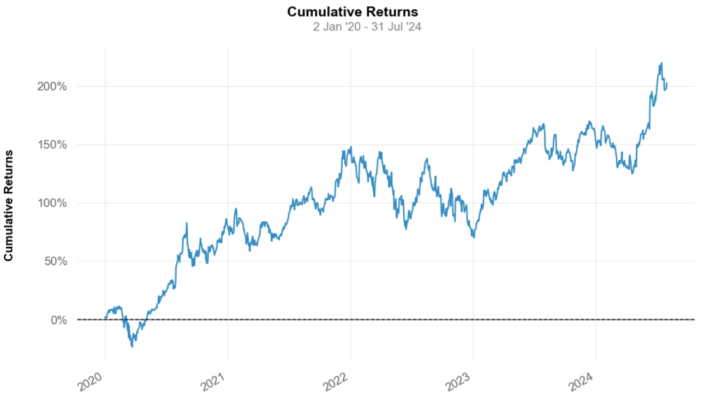
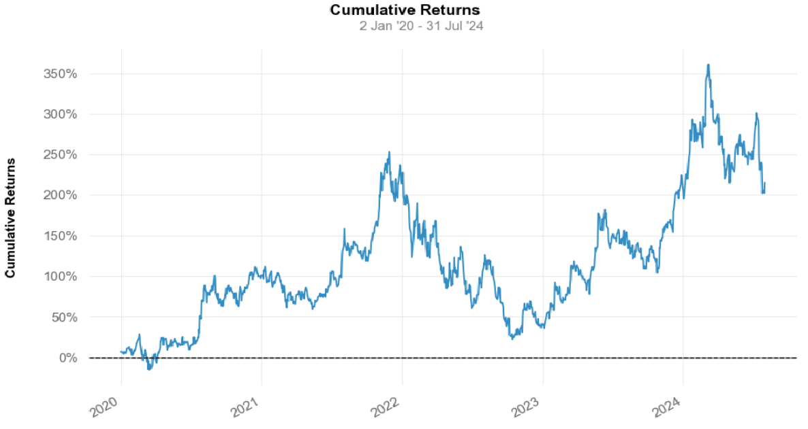
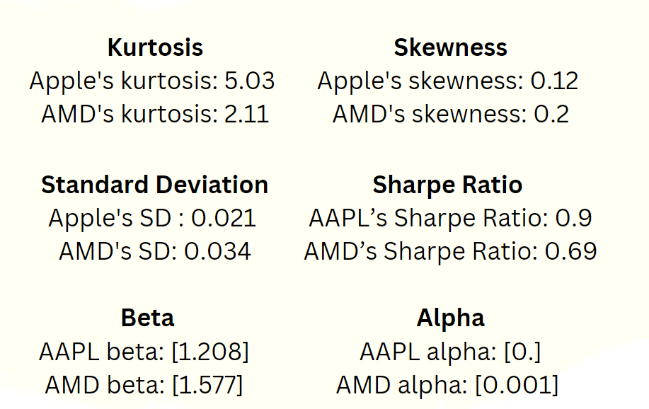

# Automated Risk Management


## Table of Contents

1. [Abstract](#Abstract)
2. [Project Description](#project-description)
   - [Key Components](#key-components)
   - [Data Sources](#data-sources)
   - [Objective](#objective)
   - [Scope of the Analysis](#scope-of-the-analysis)
3. [Project Process](#project-process)
4. [Installation](#installation)
   - [Prerequisites](#prerequisites)
   - [Steps for Installation](#steps_for_installation)
   - [Installation Notes](#installation_notes)
5. [Data collectin](#Data_collection)
   - [Data Sources](#Data_Sources)
   - [Importing Libraries](#Importing_Libraries)
   - [Data Description](#Data_Description)
   - [Data Validation](#Data_Validation)
   - [Notes on Data Collection](#Notes_on_data_collection)
6. [Results](#results)
   - [Daily Returns](#Daily_returns)
   - [Cumulative Returns](#Cumulative_Returns)
   - [Key Metrics](#key-metrics)
   - [Golden Cross Strategy](#golden-cross-strategy)
7. [Future Work](#future-work)
8. [Contributing](#contributing)
9. [Contact](#contact)
10. [Credits](#credits)
    
##### AAPL and AMD are examples, and the financial analysis is not limited to these specific stocks.

## 1. Abstract:
This project develops an automated risk management system for investment portfolios using Long Short-Term Memory (LSTM) networks. By processing historical time-series data, such as stock prices and trading volumes, the system predicts future risks and evaluates their impact. It incorporates advanced preprocessing, LSTM modeling, and regularization techniques to enhance prediction accuracy and mitigate overfitting. The system generates comprehensive risk reports and visualizations, improving efficiency and precision in managing financial risks and supporting better investment decisions.

## 2.Project Description

### Key Components
- **Data Preprocessing:** Cleans and normalizes financial time-series data to prepare it for modeling, including handling missing values and scaling features.
- **LSTM Model:** Utilizes Long Short-Term Memory networks to capture complex temporal patterns and predict future risks based on historical data.
- **Risk Detection and Assessment:** Identifies potential risks and evaluates their severity using model predictions, generating actionable insights.
- **Risk Mitigation:** Implements strategies based on risk assessments to reduce exposure and manage portfolio risk.
- **Reporting and Visualization:** Produces detailed risk reports and visualizations to communicate findings and support decision-making.

### Data Sources
The data for this project is collected from the following sources:
- **Yahoo Finance:** Historical stock prices, financial metrics, and other market data.
- **Quantstats:** Provides performance metrics and risk analysis for financial data.
- **Pandas DataReader:** Used for pulling data from various remote data sources into a pandas DataFrame.


### Objective
- Enhance Risk Detection: Improve the ability to identify potential risks in investment portfolios using advanced machine learning techniques.
- Accurate Risk Assessment: Provide precise evaluations of risk severity and probability based on historical and real-time data.
- Effective Risk Mitigation: Develop and implement strategies to proactively manage and reduce identified risks.
- Comprehensive Reporting: Generate detailed reports and visualizations to communicate risk findings and support informed decision-making.
- Improve Efficiency and Consistency: Automate risk management processes to reduce manual effort and ensure uniform application of risk management rules.

### Scope of the Analysis
- Data Collection: Gathering and integrating historical financial data, including stock prices, trading volumes, and economic indicators.
- Data Preprocessing: Cleaning and normalizing data, handling missing values, and scaling features for accurate modeling.
- Model Development: Designing and training LSTM networks to analyze time-series data and predict future risks.
- Risk Evaluation: Assessing potential risks based on model outputs, including calculating metrics like Value-at-Risk (VaR) and risk severity.
- Risk Mitigation: Formulating and recommending strategies for risk reduction based on analytical insights.
- Reporting and Visualization: Creating detailed reports and visualizations to present findings, trends, and risk assessments clearly.
- Performance Evaluation: Assessing the accuracy and effectiveness of the model and risk management strategies through backtesting and validation.
- Real-Time Analysis: Implementing real-time monitoring and updating of risk assessments based on new data.

## 3.Process

- **Identify:** Detect potential risks by analyzing historical financial data and market trends using advanced data analytics and machine learning models.
- **Assess:** Evaluate the severity and likelihood of identified risks through statistical analysis and predictive modeling, such as LSTM networks.
- **Manage:** Develop and implement strategies to mitigate and manage the identified risks, including adjustments to portfolio allocations and risk-reducing actions.
- **Monitor:** Continuously track and review risk factors and mitigation strategies in real-time, adjusting as necessary based on new data and evolving market conditions.
- **Report:** Generate detailed reports and visualizations to communicate risk findings, assessment results, and management actions clearly, providing actionable insights for stakeholders.
- 

## 4.Installation
   - [Prerequisites](#prerequisites)
   - [Steps for Installation](#steps-for-installation)
   - [Installation Notes](#installation-notes)

### Prerequisites
   - Python 3.x
   - pip (Python package installer)
   - A virtual environment tool (optional but recommended)
   - Git (for version control)

### Steps for Installation

1. **Clone the Repository:**
   ```bash
   git clone https://github.com/ACM40960/project-AbhijeetKhatode47/risk_management_project.git
   cd risk_management_project

2. **Install the dependencies:**
   ```sh
    !pip install -r requirements.txt
   ```

### Installation Notes
1. Make sure your Python version is compatible with the packages listed in requirements.txt.
2. It's recommended to use a virtual environment to avoid dependency conflicts.
3. If you encounter any issues during installation, check the compatibility of your environment or refer to the package documentation.
4. You may need to install additional packages if you extend the project beyond the current scope.

## 5.Dataset Collection

###  Data Sources
The data for this project is collected from the following sources:
- **Yahoo Finance:** Historical stock prices, financial metrics, and other market data.
- **Quantstats:** Provides performance metrics and risk analysis for financial data.
- **Pandas DataReader:** Used for pulling data from various remote data sources into a pandas DataFrame.

#### Importing Libraries
To start collecting data, the following libraries are imported:

```python
import yfinance as yf
import pandas_datareader.data as web
import datetime as dt
import pandas as pd
import quantstats as qs
```

#### Data Description

The collected dataset includes the following fields:
- **Date:** The trading date.
- **Open:** The opening price of the stock on that date.
- **High:** The highest price of the stock on that date.
- **Low:** The lowest price of the stock on that date.
- **Close:** The closing price of the stock on that date.
- **Adj Close:** The adjusted closing price (after accounting for dividends and splits).
- **Volume:** The number of shares traded on that date
    
### Data Validation
After collecting the data, it is crucial to validate it by checking for:
- Missing Values: Ensure there are no missing or NaN values in critical fields like 'Close' and 'Volume'.
- Data Consistency: Verify that the data covers the specified date range without any gaps.
- Correct Tickers: Ensure the correct stock ticker is used for fetching data.

### Notes on Data Collection
- Frequency: Daily stock data is collected, but it can be adjusted (e.g., weekly, monthly) depending on the analysis needs.
- Data Quality: Ensure that data sources are reliable, as inaccurate data can lead to misleading conclusions.
- Updating the Dataset: Regularly update the dataset to include the latest available data for continuous analysis.

## 6.Results
#### Daily return




#### AAPL Cumulative Returns:


#### AMD Cumulative Returns:


Cumulative returns showes the volatility in the stock.

### Key Metrics:
- **Kurtosis:** Greater than 3 suggests that the stock exhibits a higher likelihood of extreme returns.
- **Skewness:** Lesser the skewneess suggests that the stock may have the potential for larger positive returns but also could have more frequent smaller losses.
- **Standard Deviation:** Lower standard deviation indicates that the stock's returns are closer to the mean, suggesting lower volatility and therefore lower risk.
- **Sharp Ratio:** Higher Sharpe Ratio: Indicates a better risk-adjusted return. It means the investment is providing a higher return for the level of risk taken.
- **Alpha and Beta Values:** Assess stock performance relative to the market.
We use this key metrices to select the best stock to invest.
  
### Golden Cross Strategy:
- **Concept:**
- Simple Moving Average (SMA): The average of a stock's price over a specified period.
- SMA 50: The 50-day moving average of the stock's price.
- SMA 200: The 200-day moving average of the stock's price.
Use the code given in .ipynb file.
- **Signal:**
Golden Cross: When the SMA 50 (short-term average) crosses above the SMA 200 (long-term average), it is considered a bullish signal, suggesting that the stock's price trend is turning positive, and it might be a good time to invest.

- **Implementation:**
- Monitor Moving Averages: Calculate the SMA 50 and SMA 200 for the stock.
- Check Crossovers: Look for instances where the SMA 50 crosses above the SMA 200.
- Investment Decision: When such a crossover occurs, it signals a potential buying opportunity.

## 7.Future Work

Future improvements to this project include:

- Incorporate additional stocks and financial instruments.
- Enhance predictive models with more advanced techniques.
- Improve real-time data processing and alert mechanisms.

## 8.Contributing

Contributions are welcome! If you'd like to improve this project, please fork the repository and submit a pull request. Your contributions could include adding new features, improving documentation, or fixing bugs.

### Steps to Contribute:

1. Fork the repository.
2. Create a new branch.
3. Make your changes.
4. Submit a pull request.

## 9.Contact

For any questions or suggestions, please open an issue or contact me at [abhijeet.khatoode@ucdconnect.ie](mailto:abhijeet.khatode@ucdconnect.ie).

## 10.Credits
- Libraries: yfinance, quantstats, pyportfolioopt, ta, pandas_datareader, tensorflow, matplotlib, seaborn, plotly.
- Abhijeet Khatode
